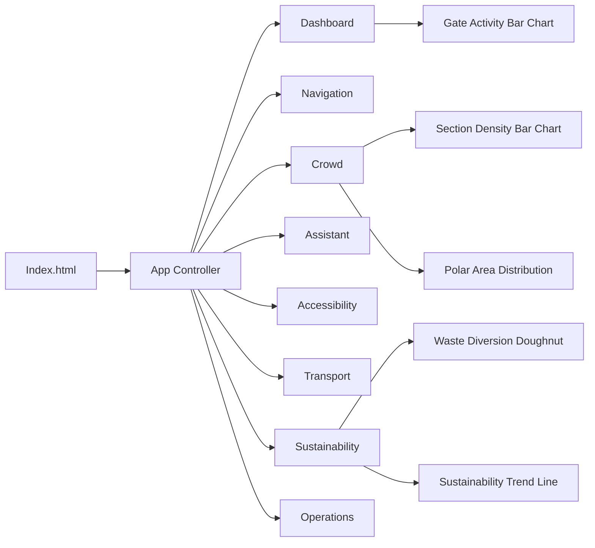
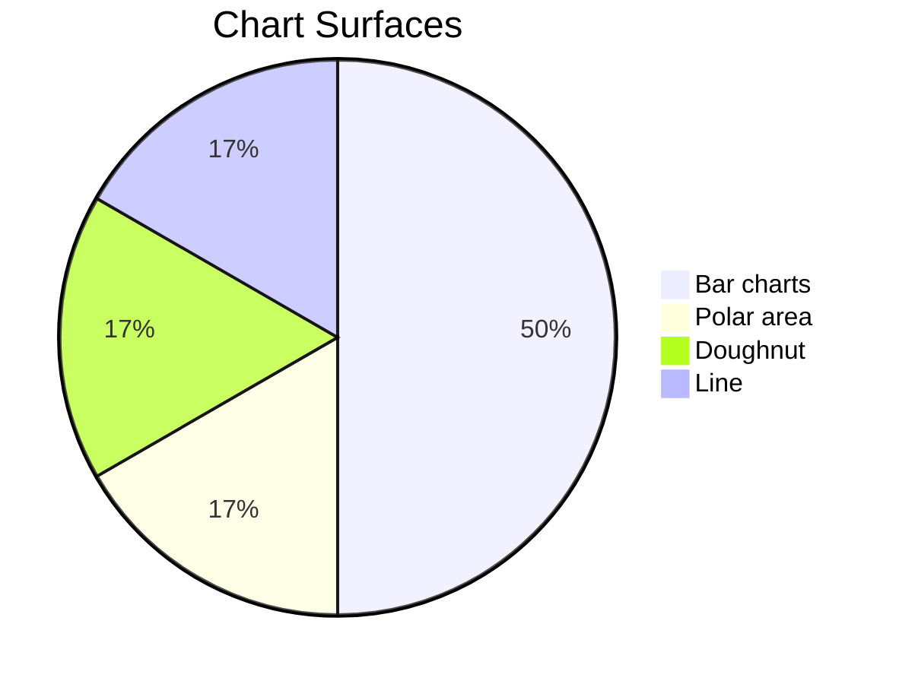

# StadiumIQ

StadiumIQ is a FIFA World Cup 2026 operations dashboard for fans, staff, volunteers, and organizers. It combines live metrics, AI-assisted workflows, venue navigation, accessibility support, and sustainability reporting in a single browser app.

## What's Included

- Match day dashboard with live attendance, gate pressure, alerts, and AI briefings
- Smart navigation with Leaflet maps and wayfinding prompts
- Crowd intelligence with density tracking and flow predictions
- Multilingual assistant for general stadium support
- Accessibility companion for inclusive venue support
- Transport hub for departures, wait times, and route advice
- Sustainability dashboard with eco metrics and fan engagement scoring
- Operations command view for incident-style coordination

## Charts And Graphs

The app currently renders five chart surfaces through Chart.js:

| Module | Chart | Type | Purpose |
| --- | --- | --- | --- |
| Dashboard | Gate Activity Levels | Bar chart | Shows crowd density by gate and highlights critical hotspots |
| Crowd | Density by Section | Bar chart | Compares density across seating and service sections |
| Crowd | Distribution Overview | Polar area chart | Visualises the overall crowd distribution around the stadium |
| Sustainability | Waste Diversion Breakdown | Doughnut chart | Breaks down recycled, composted, and landfill waste |
| Sustainability | Sustainability Progress (2026 Matches) | Line chart | Tracks waste diversion and renewable energy trends over time |

### Chart Details

- Dashboard gate activity uses a live bar chart with density-based color coding.
- Crowd intelligence uses both a bar chart and a polar area chart so operators can compare hotspots from two different angles.
- Sustainability includes a doughnut chart for waste diversion and a line chart for match-by-match progress.

## App Graph

## Chart Mix

## Tech Stack

- HTML5
- CSS3
- Vanilla JavaScript ES modules
- Chart.js
- Leaflet
- Gemini API integration

## File Structure

- `index.html` - application shell and third-party script loading
- `css/style.css` - shared UI styling
- `js/app.js` - module router and global state
- `js/dashboard.js` - match day dashboard and gate chart
- `js/crowd.js` - crowd intelligence charts and flow predictions
- `js/navigation.js` - map-based navigation
- `js/assistant.js` - multilingual assistant
- `js/accessibility.js` - accessibility tools
- `js/transport.js` - transport board and advice
- `js/sustainability.js` - sustainability charts and leaderboards
- `js/operations.js` - operations command features
- `js/gemini.js` - AI client wrapper
- `tests/` - test setup and unit coverage

## Run Locally

Open `index.html` in a browser or serve the folder with any static file server.

If you want to use the AI features, add a valid Gemini API key in the Settings modal.

## Notes

- The app is designed for a dark-first stadium operations experience.
- Accessibility features include skip navigation, ARIA labels, keyboard shortcuts, and live regions.
- The dashboard is modular, so each screen can be maintained independently.
